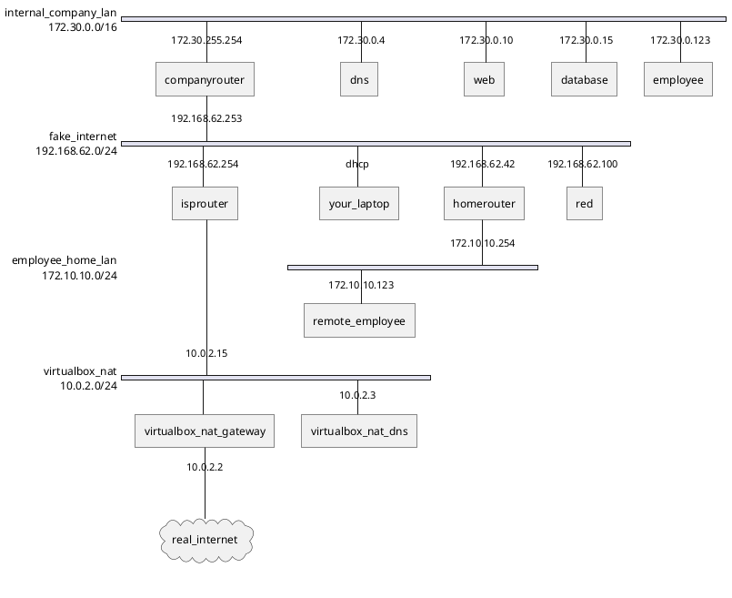

# Cybersecurity-advanced-lab

This environment is used to build up the lab set-up. It provides the base network and hosts. The entire network is built up in VirtualBox, using Vagrant and Ansible.

## Network design

The network consists of 4 subnets:

-   172.30.0.0/16: **internal company LAN**.
-   192.168.62.254/24: **fake internet**.
-   172.10.10.0/24: **employee home LAN**.
-   10.0.2.0/24: **VirtualBox NAT network**.

<!--

-->


## Usage

1. Create the following host-only network in VirtualBox to simulate the the fake internet:

    - Name: `vboxnet1` (when different, for example on Windows: "VirtualBox Host-Only Ethernet Adapter #2", change this in the [`Vagrantfile`](./Vagrantfile))
    - IP range: 192.168.62.0/24
  
    ⚠️ Linux users, read https://www.virtualbox.org/manual/ch06.html#network_hostonly to allow this IP range!

2. Make sure your vagrant boxes are up to date: `vagrant box update`

3. `vagrant up --parallel` or go slowly (1 by 1) and do `vagrant up <vm_name>`

4. Disable all the NAT connections added by vagrant: `python ./disable-nat.py`

    :warning: `vagrant ssh` won't work anymore and that is **by design**! This command is also not available in a real network, so learn to use SSH properly: login into the required hosts using SSH with IP addresses and jump/forward options!

5. SSH into the isprouter VM:

    ```bash
    ssh vagrant@192.168.62.254
    ```

    :bulb: It could be that you have to wait a minute until the isprouter VM has booted and accepts SSH requests.

    :bulb: Vagrant boxes often use the following credentials:

    - username: `vagrant`
    - password: `vagrant`

6. Execute the following commands. This can take a while!

    ```bash
    isprouter:~$ cd ansible/
    isprouter:~/ansible$ find . -type f -not -path "./files/web/app.jar" -print0 | xargs -0 dos2unix
    isprouter:~/ansible$ 
    isprouter:~/ansible$ sudo ./run-on-isprouter.sh
    ...

    # Use the following command to check if the network is setup OK
    isprouter:~/ansible$ sudo ansible-playbook --inventory inventory.yml check.yml
    ```

    :bulb: We have added `dos2unix` here for Windows users, but why do they need this? Tip: Linux users don't need this. Tip2: `\r\n` vs. `\n`.
chmod u+x run-on-isprouter.sh